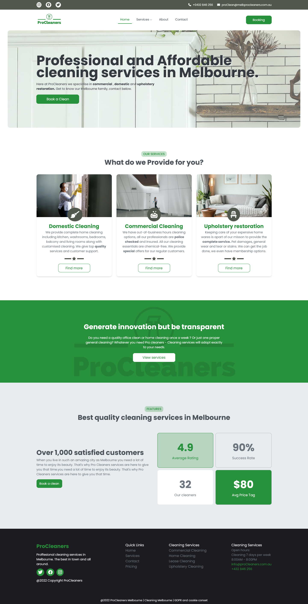

# Pro Clean Melbourne

Completed Project Link: https://musical-basbousa-5943ed.netlify.app/

Procleaners is a published mock cleaning business website that I designed and developed independently. It is a business that provides cleaning services for domestic and commercial purposes. Similar to my other mock websites, BEM methodology and SCSS was utilised simultaneously with React-Router and React Icons in order to successfully publish this project.

## Built with 
To create this Project I used React, JS, HTML and SCSS, coupled with React-Router to create a multi-paged website. 

## What I learned 
Progressing through each website I've made I'm constantly learning new tricks with CSS. Throughout this project I've learnt write pre-responsive code. If that is a term. An example of this would be using max-width and widths to make the elements shrink and grow correctly to screen sizes. For example if I have a component with a max-width of 700px and it never changes I'll then set its width to 100%. Avoiding the need to use a media query to change the width size. 

